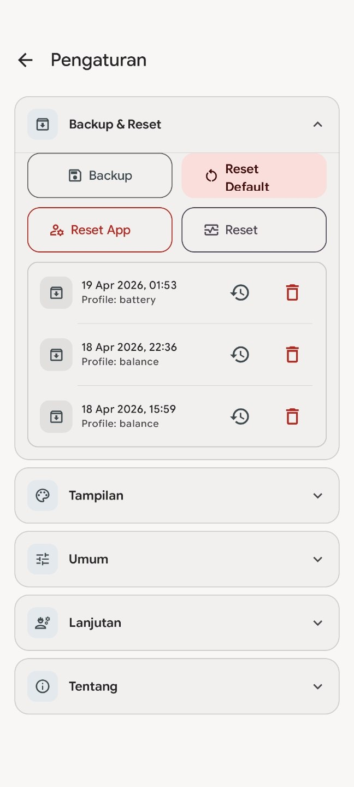
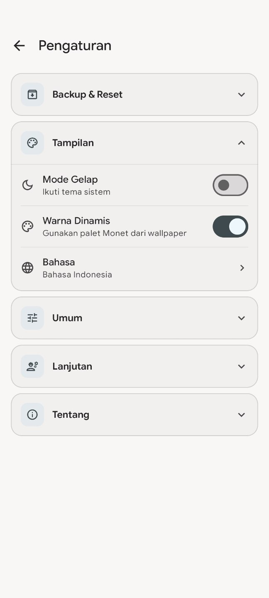
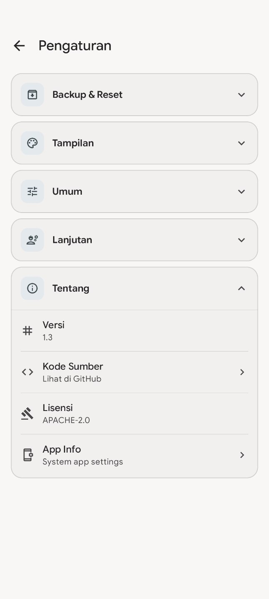
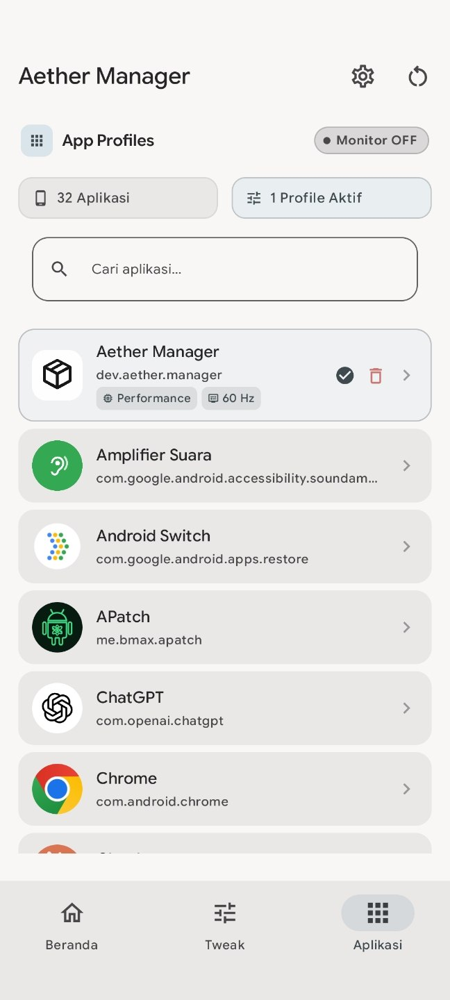
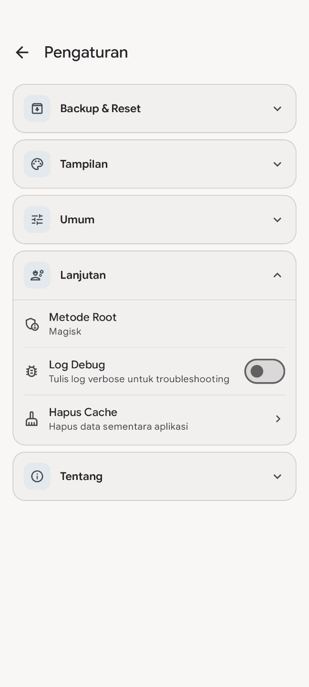
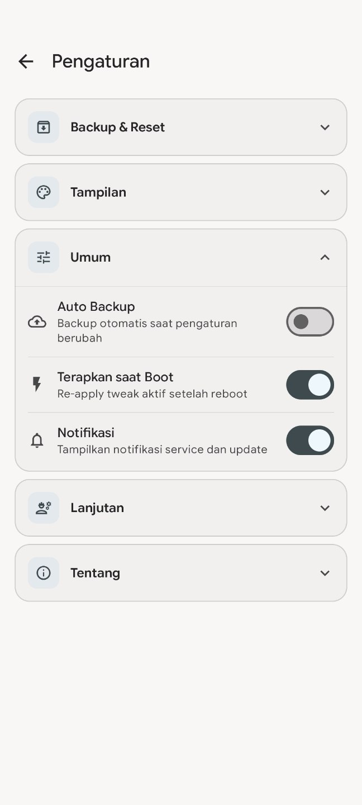
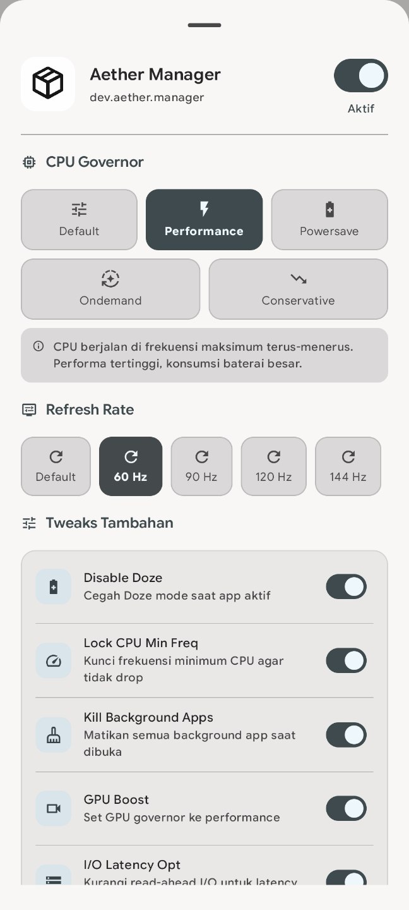
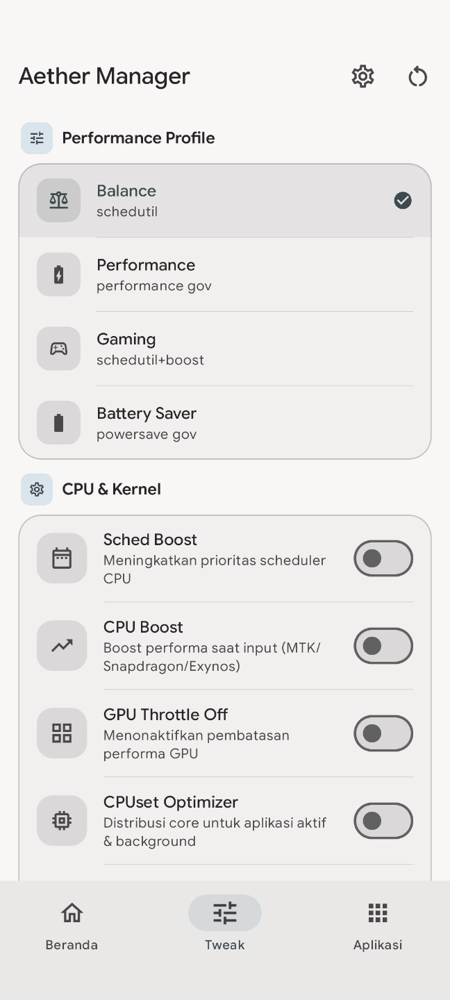
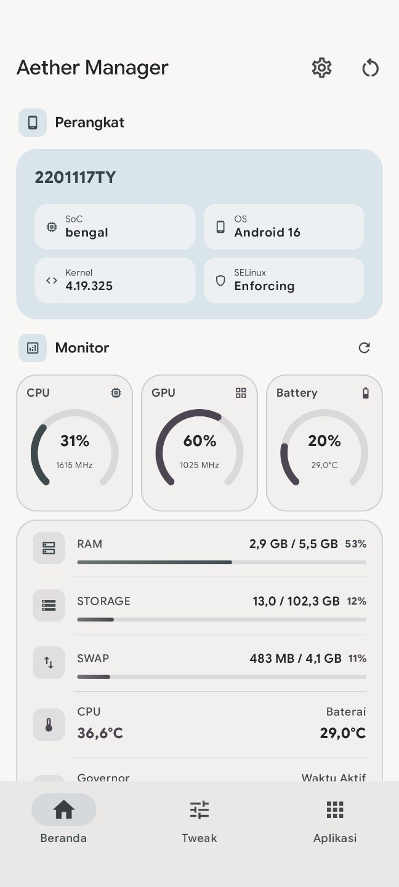

<p align="center">
  <a href="https://github.com/aetherdev01/aether-manager/releases"></a>
  <a href="https://github.com/aetherdev01/aether-manager/releases"></a>
  <a href="https://developer.android.com/about/versions/oreo"></a>
  <a href="https://developer.android.com/about/versions/15"></a>
  <a href="LICENSE"></a>
</p>

---

## Introduction

**Aether Manager** is a native Android application for rooted devices, supporting Android 8.0 (API 26) and above.

- **Performance Profiles** — Switch between Balance, Performance, Gaming, and Battery Saver profiles
- **Kernel Tweaks** — 17+ individual tweaks across CPU, GPU, memory, I/O, network, and battery
- **System Monitor** — Real-time stats: SoC, RAM, CPU/GPU frequency, temperature, uptime
- **App Profile** — Per-app optimization with automatic CPU, refresh rate, and system tweaks per application

---

## Preview

<p align="center">
  
  
  
  
</p>
<p align="center">
  
  
  
  
</p>
<p align="center">
  
</p>

---

## Downloads

[GitHub Releases](https://github.com/aetherdev01/aether-manager/releases) is the only official source for Aether Manager downloads.

## Requirements

| Item | Requirement |
|------|------------|
| Root | Magisk or KernelSU |
| Android | 8.0+ (API 26+) |
| Architecture | ARM / ARM64 |

---

## Useful Links

- [Releases](https://github.com/aetherdev01/aether-manager/releases)
- [Changelog](changelog.md)
- [Telegram Channel](https://t.me/get01projects)
- [Support / Donate](https://saweria.co/AetherDev)

---

## Bug Reports

**Only bug reports with full logs will be accepted.**

- Root/permission issues → include root manager version and Android version
- App crashes → record and upload logcat when the crash occurs
- Tweak issues → include device model, SoC, and a screenshot of the Log tab

---

## Contributors

- [@AetherDev01](https://github.com/aetherdev01) — Developer
- [topjohnwu](https://github.com/topjohnwu) — Magisk
- [tiann](https://github.com/tiann) — KernelSU
- [Android Open Source Project](https://source.android.com) — Platform Foundation

---

## License

```
Copyright 2026 AetherDev (@AetherDev22)

Licensed under the Apache License, Version 2.0 (the "License");
you may not use this file except in compliance with the License.
You may obtain a copy of the License at

    http://www.apache.org/licenses/LICENSE-2.0

Unless required by applicable law or agreed to in writing, software
distributed under the License is distributed on an "AS IS" BASIS,
WITHOUT WARRANTIES OR CONDITIONS OF ANY KIND, either express or implied.
See the License for the specific language governing permissions and
limitations under the License.
```
